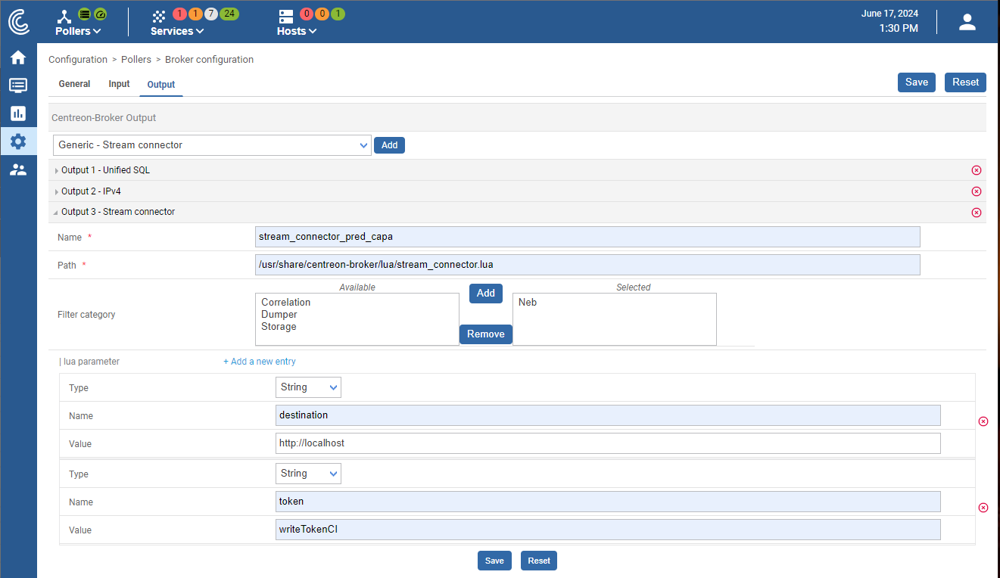
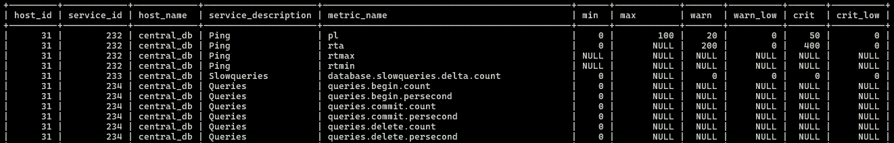
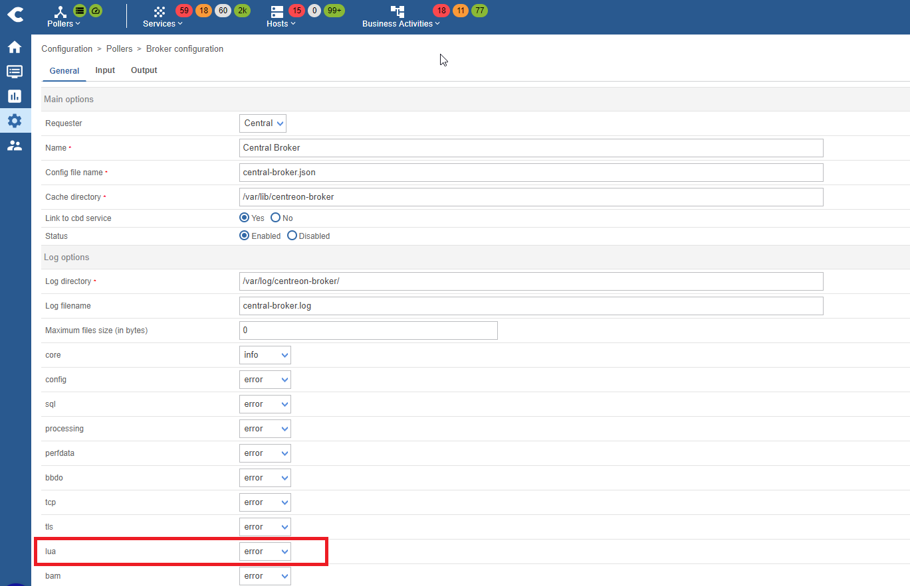

# Metrics Ingestion

## Download the stream connector

The stream connector allows you to export metrics from your Centreon to the Warp10 (the time series database).
We'll adapt the stream connector used by the anomaly detection service in order to send metrics data to the time serie database used by our predictive capacity application.
Move the stream connector script to your Centreon in this location: `/usr/share/centreon-broker/lua`
```bash
scp ~/capacity_planning_lab/stream_connector/stream_connector.lua root@<CENTREON_ADDRESS>:/usr/share/centreon-broker/lua
```
On the Centreon Central
```
chmod 644 /usr/share/centreon-broker/lua/stream_connector.lua
```


## Configuration
- Go to settings → Pollers → Broker configuration
- Click on centreon-broker-master
- Go to the Output tab
- Select Generic - Stream connector
-Click Add

- Fill in the form with the required informations:
  - Name could be anything

  - Path the path to the stream connector: /usr/share/centreon-broker/lua/stream_connector.lua

  - Make sure to add Neb in the filter category

  - Add 2 parameters, where both are string types:
     - destination this should be the url where data will be stored. It should be the : `localhost` or `<PRED_CAPA_ADDRESS>`
     - token is `writeTokenCI`.
 - Click on save



## Selecting Metrics

The stream connector uses a specified json file to retrieve the metrics that should be sent to the data factory. The file is located at /etc/centreon-broker/filters.json. By default this file does not exists and therefore no data are copied even if the stream connector is configured.

The filter should be created in `/etc/centreon-broker/filters.json` and must be in the form:

```JSON
{
   "schema": {
     "version": "1.0.0",
     "name": "centreon-collector"
   },
   "metrics": [
     {
       "host_id": 23,
       "service_id": 23,
       "name": "used",
       "bounds": ["max"]
     }
   ]
 }
```
Where `host_id`, `service_id` and `name` should change. The ids of host and services can be found in the `centreon_storage` table. The following SQL query can help fetch `host_id` and `service_id` of a specific metric.

```SQL
sudo mysql -u centreon -p -h localhost -P 3306 centreon_storage -e "SELECT id.host_id, id.service_id, id.host_name, id.service_description, m.metric_name, m.min, m.max, m.warn, m.warn_low, m.crit, m.crit_low FROM metrics AS m INNER JOIN index_data AS id ON (m.index_id = id.id) order by id.service_id, m.metric_name;"
```

You get something like:



> [!NOTE]
> We need the `max` bound of the metric in order to compare it with the forecasts and therefore estimate the time remaining to saturation.

> [!WARNING]
> Before going further, it is a good idea to make sure the filter is a valid json:
> `cat /etc/centreon-broker/filters.json | jq`


### How to update the metrics selected
In case you have some metrics already set up and you want to add new ones. You must update `filters.json` file to add the new metrics with their bounds. And make sure the file is still a valid json.

Then export the new configuration and restart the broker.

In order to debug the service, you need to set Log level on Lua to DEBUG. Then you visualize the log messages on the file `tail -f /var/log/centreon-broker/anomaly-detection.log`



# Exporting the configuration
Click on Pollers → Export configuration → Export and Reload

# Making sure data are sent to the data factory

```bash
# Make sure broker works properly with the new stream connector
tail -f /var/log/centreon-broker/central-broker-master.log

# Make sure the stream connector correctly send data
tail -f /var/log/centreon-broker/anomaly-detection.log
```

