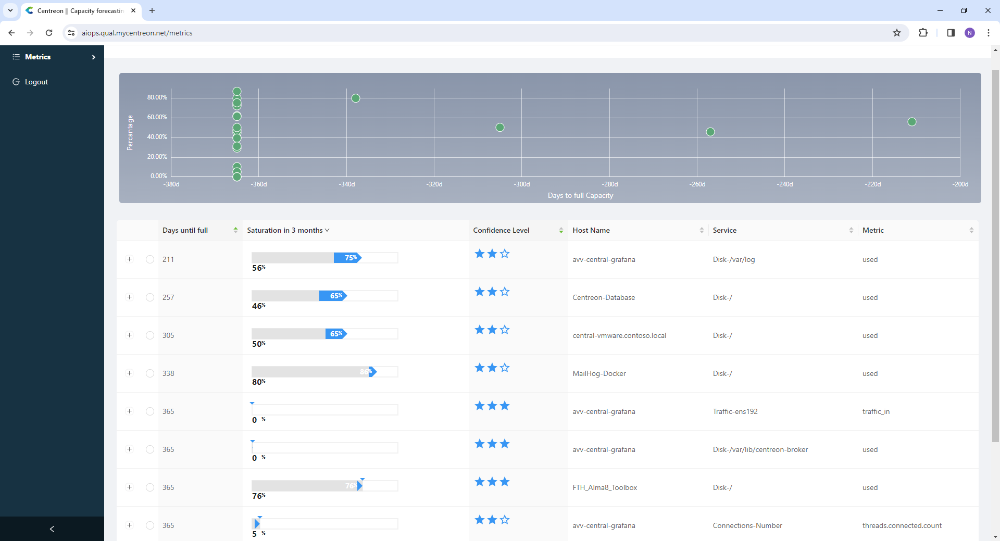
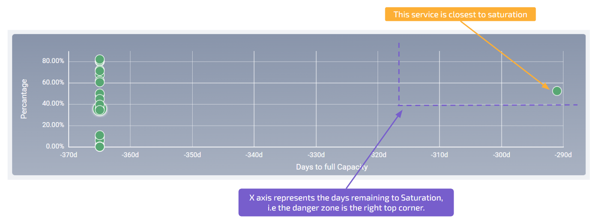
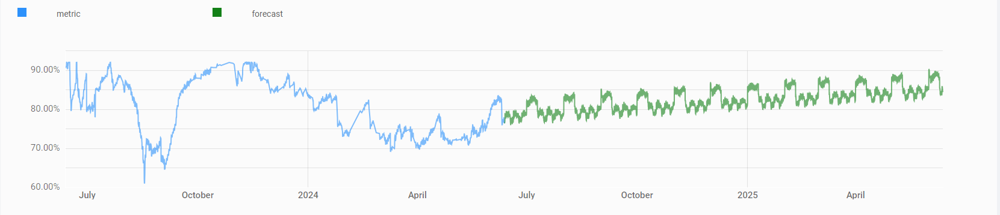
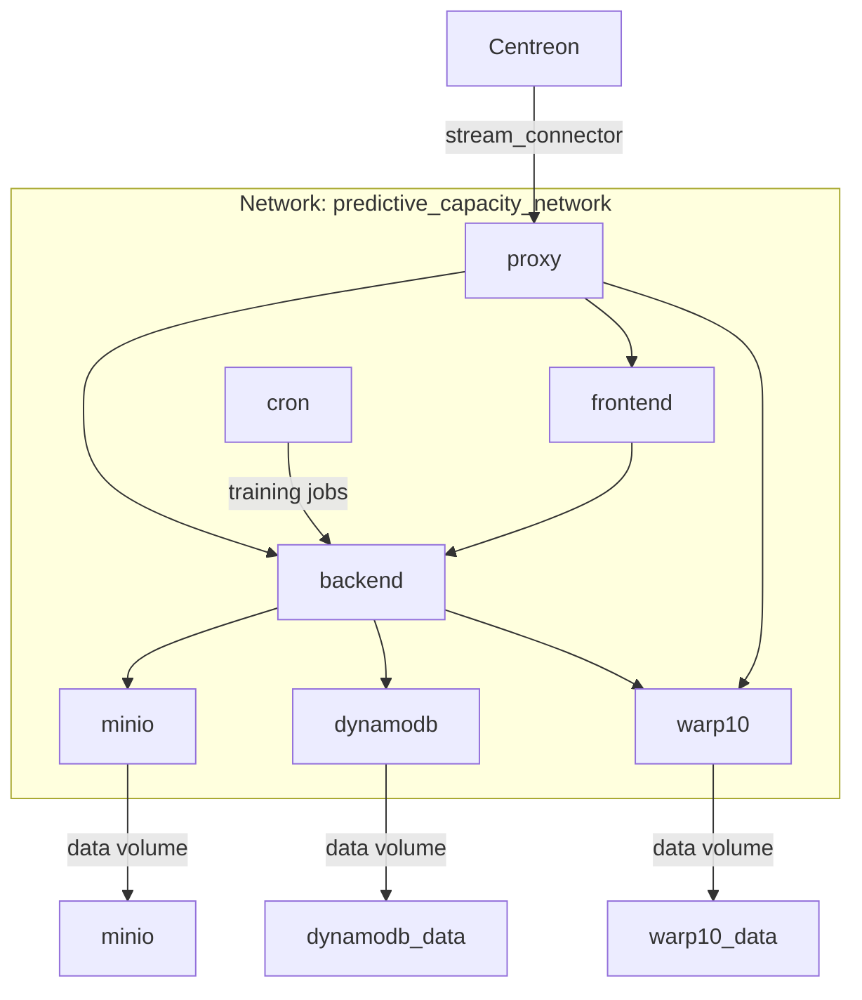

[](https://devguide.python.org/versions/) &nbsp;
 &nbsp;
[](http://github.com/badges/stability-badges) &nbsp;

- [Predictive Capacity](#predictive-capacity)
  - [Overview](#overview)
- [Description of the application](#description-of-the-application)
- [Commands to run the web application locally](#commands-to-run-the-web-application-locally)
  - [Metrics Ingestion](#metrics-ingestion)
  - [Launch the services](#launch-the-services)
- [Architecture of Capacity forecasting service](#architecture-of-capacity-forecasting-service)
  - [General layout](#general-layout)
  - [`api/forecast` endpoint](#apiforecast-endpoint)
  - [`/metrics` endpoint](#metrics-endpoint)


Predictive Capacity
======

## Overview 

When monitoring your infrastructure in classical fashion you rely on metrics breaking thresholds to keep you alerted of issues. This kind of setup is quite passive: you wait for things to break down. However in some cases you want to be more proactive in your monitoring.

This is why we are working on predictive capacity as an early warning system.


# Description of the application



Application is composed on two main sections.



A first panel represents current usage and predicted date of saturation of all metrics in a “radar” way. Tooltips on mouse over allow to have a quick glance on metrics details.

- The _vertical_ position represents the __current state__ of the service. Services have a capacity between 0 to 100% compare to their maximum capacity.  
- The _horizontal_ position represents the __expected time__ a service will reach its full capacity.  

Therefore, we can distinguish 4 zones:  

- the _bottom left_ side are all services empty with a slow capacity fill. We should be safe with those services.  
- The _top left_ side are all services which are already at high capacity by don't seem to change much and are not expected to fill much more. We should be aware of those but there is nothing to act on.  
- The _top right_ side are all services which are already at high capacity and are expected to be soon at full capacity. We should think of working of a solution for them.  
- The _top bottom_ side are all services at low capacity but are expected to be soon at full capacity. It means that those services are way too downsized and we should take care of those rapidly.  

Clicking on the dot will highlight the metrics in the listing view.

A second panel lists all the metrics in a table form.

The information provided are:

- **Days until full** indicates the number of days before saturation is reached (note: as we do prediction on a 1 year horizon, 365 days means that no stauration is forecasted)

- **Saturation in XX months**: this allows to see usage of the resource in the next 3, 6 or 12 months. Gray part represent the current usage, wheras the blue part represent the usage in 3, 6 or 12 months. Click on the “expand” icon to change the observation period.

- **Confidence Level** indicates how much confident we are about realization of the prediction

- '+' opens a dynamic panel which shows evolution of the historical data of the resource (in blue) and predicted evolution over the next year (in green)
  > 

- Identification of the metric (host name, service name and metric name)

You can sort the table according to any column by clicking on the appropriate header.


# Commands to run the web application locally
## Metrics Ingestion

In order to run the service, we need to transfer metrics data from your Centreon Instance to Warp10 (a time series database).
Please read [METRICS.md](METRICS.md) for the setup steps.


## Launch the services


```bash
docker compose --pull up
```

go to `http://localhost/metrics` to see the web app


# Architecture of Capacity forecasting service

## General layout




## `api/forecast` endpoint

The `api/forecast` endpoint makes capacity forecasts for all the metrics stored in the organization in Warp10 (time series database). A `cron` job is created for each organization

1. Each `cron` job will call the endpoint
2. After preprocessing steps
3. An algorithm generates a forecast for each metric
4. the forecasts are stored in Warp10

The command to launch forecasts of metrics:
```bash
curl -X POST "http://localhost/api/forecast"
```

## `/metrics` endpoint

the `/metrics` endpoint serves the front with metrics and their corresponding forecasts.

Here is a description of the steps involved.

1. We retrieve the users metrics and forecasts
2. some data transformation is done in order to serve the front
3. the data is sent


